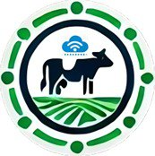

<div align="center">

#  🌾 Del Campo a tu Hogar

**Plataforma de comercio justo para la venta directa de productos lácteos artesanales en la provincia de Ubaté.**


</div>

---

## 📖 Acerca del Proyecto

**Del Campo a tu Hogar** es una solución tecnológica diseñada para dinamizar la economía local del municipio de Ubaté y sus alrededores. La plataforma elimina intermediarios en la cadena de distribución, permitiendo que los productores de leche, yogurt, arequipe y queso artesanal vendan sus productos directamente al consumidor final con precios transparentes y competitivos.

Este proyecto se desarrolla como propuesta dentro de la **Universidad de Cundinamarca (Sede Ubaté)** para el programa de Ingeniería de Sistemas y Computación.

---

## ✨ Características Especiales

* **Sistema de Roles:** Accesos diferenciados para el perfil de Comprador (catálogo, carrito, historial de pedidos) y Productor Campesino (gestión de inventario, métricas de ventas).
* **Catálogo de Venta Directa:** Filtrado inteligente de productos lácteos por tipo, volumen y productor.
* **Panel de Control Simplificado:** Interfaz amigable orientada a facilitar la publicación de productos por parte de los productores locales.
* **Diseño Responsivo Completo:** Experiencia fluida tanto en computadores de escritorio como en dispositivos móviles.

---

## 🛠️ Stack Tecnológico y Justificación Técnica

| Tecnología | Componente | ¿Por qué la elegimos? |
| :--- | :--- | :--- |
| **React + Vite** | Frontend | Permite construir una interfaz modular reactiva. Vite ofrece tiempos de compilación ultrarrápidos y recarga en tiempo real (*HMR*). |
| **Tailwind CSS** | Estilos | Agiliza el diseño adaptativo mediante clases utilitarias, manteniendo un sistema de diseño limpio sin CSS duplicado. |
| **Node.js / Express / NestJS** | Backend | Garantiza una arquitectura de API REST ligera, eficiente y asíncrona para gestionar múltiples peticiones simultáneas. |
| **PostgreSQL / Supabase** | Base de Datos | Asegura integridad relacional nativa para vincular usuarios, productos y órdenes de compra, simplificando la autenticación. |
| **Git & GitHub** | Control de Versiones | Permite colaboración en equipo con flujos de trabajo estructurados (*monorepo*) y despliegue continuo. |

---

## 📁 Estructura del Repositorio

El proyecto utiliza una arquitectura de **monorepositorio** para mantener sincronizada la interfaz y la API web:

```text
Del-Campo-a-tu-Hogar/
├── backend/                  # Servidor API REST y reglas de negocio
│   ├── src/
│   │   ├── auth/            # Controladores y servicios de autenticación (JWT)
│   │   ├── productos/       # Endpoints para gestión de lácteos
│   │   └── pedidos/         # Procesamiento del carrito de compras
│   ├── package.json
│   └── .env.example
├── frontend/                 # Aplicación del cliente en React
│   ├── src/
│   │   ├── components/      # Componentes UI reutilizables (Botones, Tarjetas)
│   │   ├── pages/           # Vistas (Catálogo, Dashboard Productor, Login)
│   │   └── services/        # Conexiones HTTP hacia el backend
│   ├── index.html
│   └── package.json
└── README.md                 # Documentación técnica del proyecto

---

## ⚡ Guía de Ejecución Rápida

**Requisitos Previos**
**Node.js** v18.0 o superior
**npm** v9.0 o superior

---

## 1. Clonar el repositorio

**Bash**
git clone [https://github.com/DaniSuarez18/Del-Campo-a-tu-Hogar.git](https://github.com/DaniSuarez18/Del-Campo-a-tu-Hogar.git)
cd Del-Campo-a-tu-Hogar

---

## 2. Ejecutar el Backend

**Bash**
cd backend
npm install
npm run dev

---

##3. Ejecutar el Frontend
**Bash**
cd ../frontend
npm install
npm run dev

---

##🔑 Credenciales de Prueba

| Rol | Correo Electrónico | Contraseña |
| :--- | :--- | :--- |
| **Administrador** | admin@delcampo.co | admin123 |
| **Productor / Campesino** | productor@delcampo.co | campesino123 |
| **Cliente / Comprador** | cliente@delcampo.co | cliente123 |

---

## 👥 Equipo de Desarrollo

**Andrés Santiago Gómez Castiblanco**
**Daniel Santiago Suárez Alarcón**
